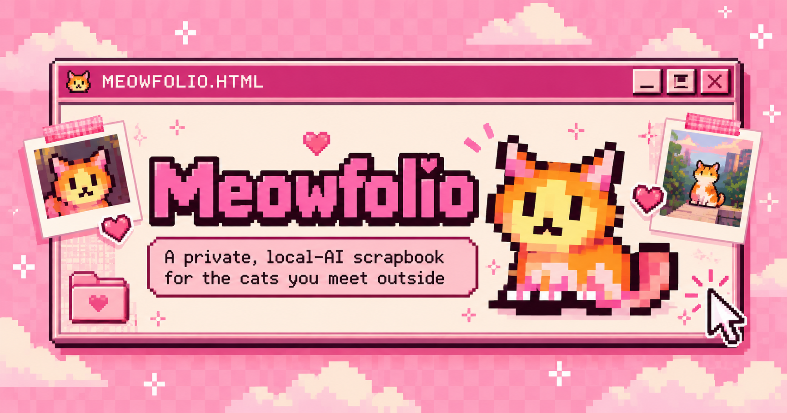

<div align="center">



<br />

[](https://github.com/ThunderKhan/meowfolio/actions/workflows/ci.yml)


**Little cats, big memories.**

A private, pixel-pink scrapbook for the cats you meet outside. Powered by real open-weight computer vision that runs **in your browser**, not on a photo-upload server.

[**Try Meowfolio ↗**](https://mymeowfolio.vercel.app) · [How it works](#how-it-works) · [Try it yourself](#try-it-yourself) · [Architecture](#under-the-hood) · [Testing](#testing) · [Touch Grass challenge](docs/TOUCH_GRASS_SUBMISSION.md)

</div>

---

## The street is full of recurring characters

There's a cat you see near the corner shop. Another that always sleeps under the same tree. You photograph them, forget which one was which, and keep walking.

**Meowfolio gives those tiny encounters a place to live.** Take a photo on your walk, let local AI find the cat, name it, and build a personal history one sighting at a time.

> **Collect sightings, not screen time.**

Meowfolio was built for the **[Hacktoberfest Open-Source AI Challenge · Week 1: Touch Grass](https://dev.to/challenges/hacktoberfest-week1-2026-10-05)**. The idea is to make looking up from your phone more rewarding—not to create yet another feed that keeps you indoors.

## How it works

```text
Go outside
    ↓
Spot a cat → snap or choose a photo
    ↓
YOLOS-tiny detects cats (inside your browser)
    ↓
Choose a cat if there are several
    ↓
DINOv2-small extracts a visual embedding
    ↓
YOU choose: new cat or previously saved cat
    ↓
Save photo + sighting to local IndexedDB
    ↓
Walk on. Revisit the scrapbook later. ♡
```

**The AI finds the cat; you decide who it is.** Meowfolio intentionally does **not** automatically declare two cats to be the same animal. Its held-out matching evaluation found a false positive, so automatic familiar-face suggestions remain disabled. Manual selection of a saved cat continues to work. [Read the evidence.](docs/evaluation-results/2026-10-08-cat-individuals.md)

## What's inside the scrapbook?

| Feature | What it means in practice |
| --- | --- |
| 📷 **Spot a cat** | Use your camera or photo library, preview the image, and let the local detector find one or multiple cats. |
| 🐾 **Human-controlled identity** | Name a newly found cat, or link a repeat encounter to one already saved. No silent or overconfident identity guesses. |
| 💿 **Photo inbox** | Save an unprocessed photo for later when you don't want to wait for model initialization; it survives reloads in this browser. |
| 📓 **Cat memory pages** | Individual profiles, a chronological gallery, original encounter photographs, timestamps and optional notes. |
| 🗺️ **Optional location** | Ask explicitly before recording a location; private coordinates remain collapsed, and denial never blocks saving. |
| 🎀 **Story Studio** | Make a 1080×1920 story card in Candy, Midnight or Golden Hour; adjust photo framing and export locally as PNG. |
| 💾 **Backup and restore** | Download your private collection (including photos, embeddings and pending items) and restore into another empty browser profile. |
| 💗 **Y2K design** | Pink pixel windows, old-school controls, photo stickers, a pixel-cat favicon and share-card artwork. |

No login. No hosted cat database. No image-inference endpoint.

## Try it yourself

**Live app:** https://mymeowfolio.vercel.app

For the shortest real demo:

1. Open the website in Chrome or another supported modern browser. It also works on Android Chrome, subject to your device's available memory and model initialization speed.
2. Choose **Camera** or **Add photo**, then select a clear photo containing a cat.
3. Tap **Find the cat**. On first use, Meowfolio asks permission **before downloading** the open-weight model/runtime assets from external hosts.
4. Follow the detection result; if several cats appear, choose the one you want. Then **Name this cat** or **Choose a saved cat**.
5. Save the encounter and open the scrapbook. Reload **the same website origin** to verify the cat is still there.
6. Open the cat's memory page to see the photo history or make a story card.

**Short on time or using a slow phone?** Choose **Save photo for later**, then process it from your local inbox when convenient.

> **Privacy and storage reality:** Cat photos, names, embeddings, notes and saved locations stay in this browser's IndexedDB; your chosen profile label stays in localStorage. No account or cloud sync exists. First-time model downloads require internet access, and cached models can be evicted by your browser—so “local AI” does **not** mean guaranteed offline access on an uncached device. Changing browsers, clearing site data or changing the site origin can make your scrapbook unavailable. Use **Download backup** and keep the JSON file private.

## Under the hood

Meowfolio runs real machine-learning inference client-side, not a simulated or remote recognition API.

| Layer | Implementation |
| --- | --- |
| UI | React 19 · TypeScript 5.9 · Vite 8 · Tailwind CSS 4 |
| Cat detection | [YOLOS-tiny](https://huggingface.co/Xenova/yolos-tiny), pinned ONNX conversion |
| Image embedding | [DINOv2-small](https://huggingface.co/Xenova/dinov2-small), 384-dimensional normalized embedding |
| Model runtime | [Transformers.js](https://github.com/huggingface/transformers.js), Web Worker and WebAssembly |
| Persistence | Browser IndexedDB; atomic transactions and duplicate-save protection |
| Hosting | Static Vercel deployment and CDN. **No backend API or remote database.** |

```text
camera / photo picker
         │
         ▼
React scan flow ──────────────┐
         │                    │
         ▼                    ▼
AI Web Worker             local IndexedDB
  ├── pinned model assets    ├── cats + embeddings
  ├── YOLOS → detection      ├── encounters + photos
  └── DINOv2 → embedding     └── pending photo inbox
         │                    │
         └── human decision ──┘
                   │
             cat scrapbook
                   │
           1080×1920 story card
```

**Why open-weight/local AI?** With a browser-run detector and embedder, the application can inspect and control how inference happens, cache approved model revisions, avoid uploading private cat images, and run the scrapbook without a paid inference API. Initial model/runtime assets are downloaded from Hugging Face and supporting runtime CDNs only with permission. GitHub's public API is contacted separately for the optional repository star count; no photo data is attached to that request.

### What the models do *not* prove

A visual embedding is **not a verified animal identity**. An evaluation of 50 cat photos found a false familiar-cat suggestion under the frozen candidate policy. The automatic matching release gate therefore failed and remains turned off. This project is a **hackathon proof of concept**, not a validated pet recognition or animal-location tracking service. [Evaluation methodology and results →](docs/evaluation-results/2026-10-08-cat-individuals.md)

## Run locally

Requires **Node.js 22.12+**, npm and a modern browser.

```bash
git clone https://github.com/ThunderKhan/meowfolio.git
cd meowfolio
npm ci
npm run dev
```

Vite prints a development URL (usually `http://localhost:5173`). Localhost has **different browser storage** from the production HTTPS origin, so cats saved on one do not automatically appear on the other.

### Testing

```bash
npm run typecheck
npm test
npm run build
npm run audit:production
npx playwright install chromium
npm run test:e2e:production
npm run test:e2e
```

The production browser suite checks the real release build, asset safety, storage, navigation and consent boundary. The broader E2E suite tests the scan and storage flows, including genuine YOLOS → DINOv2 execution in Chromium/WASM. The separate [Lighthouse workflow](.github/workflows/lighthouse.yml) produces mobile and desktop **lab** reports; its scores are not Android field measurements.

**Manual Android field validation belongs to the project author.** The [Android test protocol](docs/ANDROID_FIELD_TEST.md) covers first-use consent, warm inference, save/reopen, manually linked repeats, location denial and stable-origin redeploy persistence. Don't present these as completed unless physically tested.

For a reviewer-focused walkthrough, see [PROJECT_TESTING.md](docs/PROJECT_TESTING.md).

## Repository map

```text
src/
├── ai/               model manifest, worker, inference client
├── scan/             camera, detection, identity decisions
├── scrapbook/        collection, history, backup/restore
├── storage/          IndexedDB and portable backup
├── story/            editor, themes and PNG export
├── navigation/       pixel navbar and GitHub stars
└── evaluation/       development-only matching evaluation

docs/
├── planning/         archived scope, PRD, spec and build evidence
├── ANDROID_FIELD_TEST.md
├── PROJECT_TESTING.md
├── TOUCH_GRASS_SUBMISSION.md
└── evaluation-results/

public/               favicon and Open Graph artwork
e2e/                  browser and real-model tests
e2e-production/       production-mode browser tests
```

### Project history

The original [scope, PRD, technical spec and build checklist](docs/planning/) are preserved in `docs/planning/` with their review snapshots. They document how the idea evolved; they are **not** Devpost requirements. The current source and this README describe the shipped product.

## Privacy, attribution, and license

- Original Meowfolio source: **[Mozilla Public License 2.0](LICENSE)**, copyright © 2026 ThunderKhan. MPL-2.0 is open source with **file-level copyleft**: you can reuse and distribute the code, but distribution of modified covered files carries MPL obligations.
- [Third-party notices](THIRD_PARTY_NOTICES.md) credit the model creators, ONNX conversions and main runtime dependencies. Their licenses remain their own; Meowfolio does not relicense those assets.
- Your own photographs and exported private scrapbook data are **not** included in the project's open-source license.
- Meowfolio is independent of the referenced model providers and is not affiliated with Hacktoberfest organizers beyond challenge participation.

Contributions are welcome; see [CONTRIBUTING.md](CONTRIBUTING.md).

---

<div align="center">

**Go find a cat. Give it a name. Remember the little things.** 🐈

[**Open Meowfolio ↗**](https://mymeowfolio.vercel.app) · [Repository](https://github.com/ThunderKhan/meowfolio) · [Touch Grass notes](docs/TOUCH_GRASS_SUBMISSION.md)

Made with ♡ by [@ThunderKhan](https://github.com/ThunderKhan).

</div>
